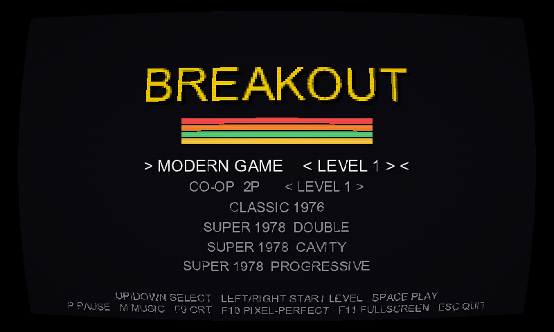
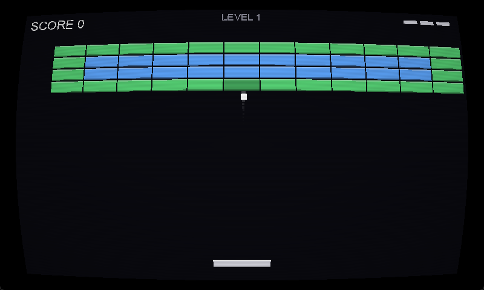
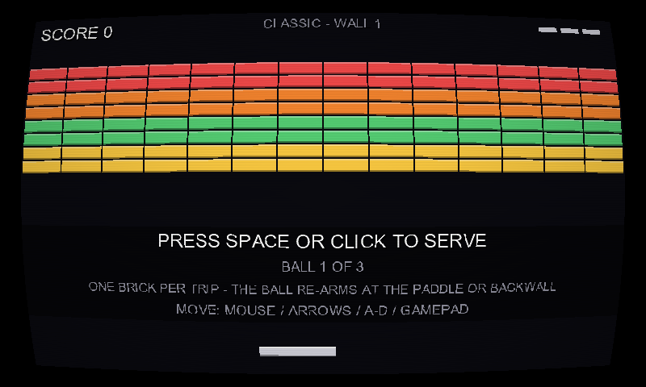
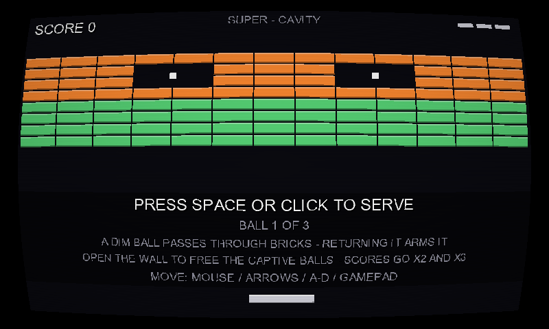

<div align="center">

# BREAKOUT

### Learn MonoGame by reading one small game

[](https://github.com/blugart-dev/MonoGame-Breakout/actions/workflows/build.yml)
[](https://dotnet.microsoft.com/)
[](https://monogame.net/)
[](https://blugart-dev.github.io/MonoGame-Breakout/)
[](LICENSE)



*A complete Breakout clone written to be **read**: every file carries pedagogical
comments explaining the MonoGame idioms it uses and the reasoning behind
non-obvious choices. No prior game-engine experience assumed —
the repo teaches MonoGame from first principles.*

**[Run it](#run) · [Study guide](https://blugart-dev.github.io/MonoGame-Breakout/) · [The modes](#six-ways-to-play-one-engine) · [Features](#features) · [How to learn](#how-to-learn-from-this-repo)**

</div>

---

The project is entirely **asset-free**: every visual is a tinted 1×1 white
texture, every sound — the SFX *and* the looping music track — is synthesized
at startup, and the only content pipeline assets are the HUD font and the CRT
shader (which is source code, not art).

> 📖 **[The study guide](https://blugart-dev.github.io/MonoGame-Breakout/)** —
> fifteen concept sections in reading order, a project map, an engine-concepts
> glossary, and exercises. (Source: [`docs/index.html`](docs/index.html),
> served by GitHub Pages.)

## Run

```bash
dotnet run
```

Requires the **.NET 9 SDK** (the project targets `net9.0`; `RollForward`
lets any newer runtime work). No other setup — NuGet restores MonoGame
automatically and the content pipeline runs as part of the build.

> **Linux note:** the HUD font is built from your installed *Arial*. On Linux,
> either install the MS core fonts (`ttf-mscorefonts-installer`) or change
> `FontName` in `Content/Fonts/Hud.spritefont` to a font you have.
> Also, compiling the CRT shader (`Content/Shaders/Crt.fx`) uses Direct3D's
> shader compiler, which on Linux runs under Wine — run MonoGame's
> [one-time setup script](https://docs.monogame.net/articles/getting_started/1_setting_up_your_os_for_development_ubuntu.html)
> (`net9_mgfxc_wine_setup.sh`). See `.github/workflows/build.yml` for the
> exact CI recipe.

## Six ways to play, one engine

A mode is not a flag — it is *which state objects drive the shared entities*.
The title screen picks the pair; `GameStateManager.CreateServeState` is the
only switch point.

| | | |
|:---:|:---:|:---:|
|  |  |  |
| **Modern** — house rules | **Classic** — the 1976 manual | **Super: Cavity** — the 1978 manual |

| Mode | Rules from | The game |
|---|---|---|
| **Modern** | this repo's house rules | three tiered boards, power-ups *and* falling debris, multiball, continuous paddle aiming, per-brick speed ramp |
| **Co-op 2P** | modern rules × 2 | two paddles, half a court each — P1 mouse/`A`/`D`, P2 arrows/gamepad; lives shared, catches personal |
| **Classic** | Atari's 1976 operation manual | four discrete ball speeds, four fixed paddle exits, one brick per trip, half-width paddle after breaking out — exactly two walls, **896-point maximum** |
| **Super: Double** | the 1978 manual (TM-118) | two stacked paddles on one set of controls, two balls per serve (only the first costs one), ×2 points while both fly |
| **Super: Cavity** | the 1978 manual (TM-118) | two captive balls sealed in the wall escape through the holes you open and join play for ×2/×3 scoring |
| **Super: Progressive** | the 1978 manual (TM-118) | an endless wall scrolls toward you; a brick is worth whatever screen zone it currently occupies |
| **RANDOM** *(level select)* | `BoardGenerator` | endless procedural boards, emitted in the same text format the hand-made levels use — seeded, so replays re-roll identical boards |

The arcade numbers are transcribed from the original operation manuals, the
ambiguities the manuals leave open are flagged in the code, and the test suite
pins the lot ([study guide §11](https://blugart-dev.github.io/MonoGame-Breakout/#history)
puts the three rule sets side by side).

The cabinets explained these laws on a printed bezel card; here they explain
themselves in play: the 1978 ball draws **translucent** while the pass-through
rule has it immaterial, the discrete speed ladders announce each step with an
audible zip and a spark, Progressive's wall visibly *slides* on each advance,
and every arcade serve screen carries a one-line rule card for its mode.

## Controls

| Input | Action |
|---|---|
| `↑` `↓` / `W` `S` (title) | Select mode |
| `←` `→` (title) | Pick starting level or `RANDOM` endless boards (modern / co-op) |
| Mouse / `←` `→` / `A` `D` | Move paddle (gamepad: D-pad / left stick) |
| `Space` / Left click / `A` button | Launch ball (modern) / serve (classic, super) |
| `Enter` / Click (on game over) | Play again |
| `T` (on game over) | Back to the title screen |
| `R` / `X` button (on game over) | Watch a replay of the run (`T` stops it; `P` pauses it) |
| `B` (while paused) | Key rebinding screen |
| `P` | Pause / resume (also auto-pauses when the window loses focus) |
| `M` | Music on / off |
| `F9` | CRT shader (scanlines + curvature) on / off |
| `F11` | Borderless fullscreen |
| `F10` | Integer ("pixel perfect") scaling toggle |
| `F3` | Debug overlay (FPS, ball speed, entity counts) |
| `Esc` | Quit |

In **co-op**, player 1 holds the left half (mouse or `A`/`D`) and player 2
the right half (arrows, or a gamepad's D-pad/stick).

## How to learn from this repo

1. **Play it** (`dotnet run`) so you know what the code produces.
2. **Open the [study guide](https://blugart-dev.github.io/MonoGame-Breakout/)**
   (or `docs/index.html` locally in a browser).
   Fifteen concept sections in reading order (game loop, fixed timestep,
   SpriteBatch, content pipeline, input polling, AABB collision, state
   machines, virtual resolution, juice, production habits, the 1976/1978
   reconstructions, procedural boards, replays & determinism, the CRT
   post-process, the testing boundary), each naming the files to open next
   to it, plus an engine-concepts glossary and exercises.
3. **Read the code** — the comments are the textbook. A good order:
   `Program.cs` → `BreakoutGame.cs` → `Source/States/PlayingState.cs`,
   then outward to whatever it touches.
4. **Study the feature commits.** Every exercise from the guide's three
   Appendix C rounds is implemented now — one commit each, so
   `git log --oneline` doubles as a reading list: check out any commit's
   diff to see exactly what one feature costs.

## Features

- **Replays** — every run records itself (RNG seed + one input frame per
  60 Hz tick); `R` on the game-over screen re-simulates it, `T` stops,
  `P` pauses. Determinism as a feature, and the repo's flagship lesson
- **Procedural boards** — the level select's `RANDOM` slot plays endless
  generated boards: `BoardGenerator` emits the same text format
  `LevelLoader` parses, with difficulty knobs (rows, hit-point budget,
  unbreakable density, mirroring) scaling per board
- **Action map** — gameplay reads named intents (`GameAction`), not keys;
  bindings live in runtime-rebindable dictionaries (`ActionMap`), with full
  gamepad support and an in-game key rebinding screen (`B` from pause)
- **High scores** — top five per table (each mode, with endless random runs
  scored separately) persisted as JSON under the per-user `ApplicationData`
  folder; game over shows the table, the title shows the best
- **CRT shader** (`F9`) — scanlines locked to virtual rows, barrel curvature
  and vignette in one HLSL `Effect`, applied where the frame is presented
- **Juice** — brick-break particles, trauma-based screen shake, ball trail,
  synthesized SFX with random pitch variation; power-up drops: wide paddle
  (pink), multiball (cyan) — a life is lost only when the *last* ball
  drops — and **falling debris**, the anti-power-up that halves the paddle
  for eight seconds if you catch it
- **Music** — a synthesized chiptune loop on a looping `SoundEffectInstance`:
  ducks (drops low, doesn't stop) on pause and game over, `M` mutes
- **Levels as plain text** — boards are `.txt` grids
  (`Content/Levels/*.txt`); tier digit = hit points = color, `X` =
  unbreakable; score and lives carry across levels, ball speed resets per
  board
- **The production layer** — virtual 800×480 resolution rendered to a
  `RenderTarget2D` and letterboxed to any window size, optional integer
  ("pixel perfect") scaling, resizable window, borderless fullscreen,
  auto-pause on focus loss, debug overlay
- **The arcade loop** — Title → Ready → Playing → LifeLost → GameOver (plus
  Pause and LevelCleared), 3 lives/serves, paddle-position-controlled bounce
  angle: the aiming mechanic that defines the genre

## Project layout

```
Program.cs             entry point — two lines
BreakoutGame.cs        application shell: window, loop, two-pass draw
Source/
  Screen.cs            virtual resolution constants
  GameMode.cs          Modern / Co-op / Classic / 3× Super — which states drive the session
  GameSession.cs       the world: entities, score, lives, level/wall index
  Entities/            Paddle, Ball, Brick, PowerUp (prizes + debris)
  Systems/             input + action map (kbd/pad), replay (snapshot + tape),
                       collision, levels + board generator, classic 1976
                       rules + wall, super 1978 rules + walls, high scores,
                       virtual screen (+ CRT pass), particles, shake,
                       audio synth + music, debug overlay, screenshot rig
  States/              GameState base + Title/Ready/Playing/ClassicReady/
                       ClassicPlaying/SuperReady/SuperPlaying (abstract,
                       + Double/Cavity/Progressive)/Pause/Rebind/LifeLost/
                       LevelCleared/GameOver
Content/
  Content.mgcb         pipeline manifest (font + CRT shader)
  Fonts/Hud.spritefont rasterized at build time by the pipeline
  Shaders/Crt.fx       HLSL, compiled to a platform blob at build time
  Levels/level0*.txt   runtime-loaded, copied via csproj — not pipelined
Tests/
  Breakout.Tests/      xUnit suite for the pure logic (rules, walls, generator, …)
docs/
  index.html           the study guide — open in a browser (or via Pages)
  media/               the screenshots above
```

## Commands

```bash
dotnet build                      # compile (content pipeline runs as part of the build)
dotnet run                        # play
dotnet test Tests/Breakout.Tests  # unit tests (the pure game logic)
dotnet format                     # code style
dotnet run -- --screenshot classic out.png   # boot a mode, save one settled frame, exit
                                             # (how docs/media stays honest; also: title,
                                             #  modern, coop, double, cavity, progressive)
```

## Tests

`Tests/Breakout.Tests` (xUnit) covers everything in the game that is a pure
function: the 1976/1978 rule tables (speed ladders, rebound angles, the
never-vertical law), the manual-sourced walls (the 448-point 1976 wall, the
Super walls and cavity holes, Progressive's scroll/re-pricing/feed pattern),
the board generator (determinism, format contract, mirroring, winnability),
the shipped level files (parsed exactly as the game parses them), AABB
collision response, the ball's aiming math, high-score ranking, and the
replay system's recorded-vs-live action contract.
The deliberate boundary is the lesson: game *rules* are unit-testable because
they are pure; the frame loop, rendering and feel are play-tested. CI runs the
suite on both OSes.

## License

[MIT](LICENSE).
